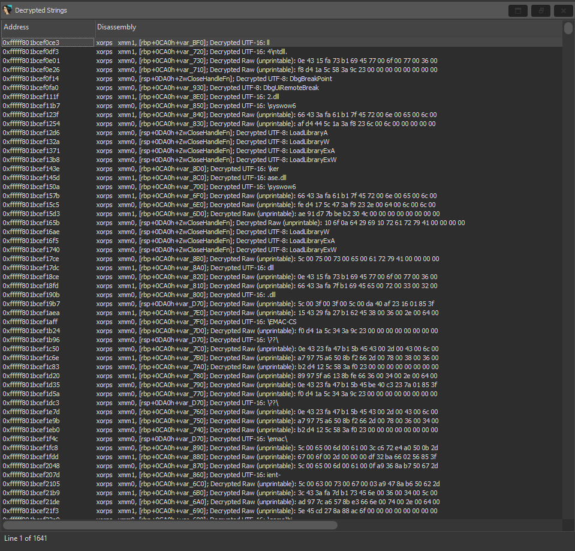
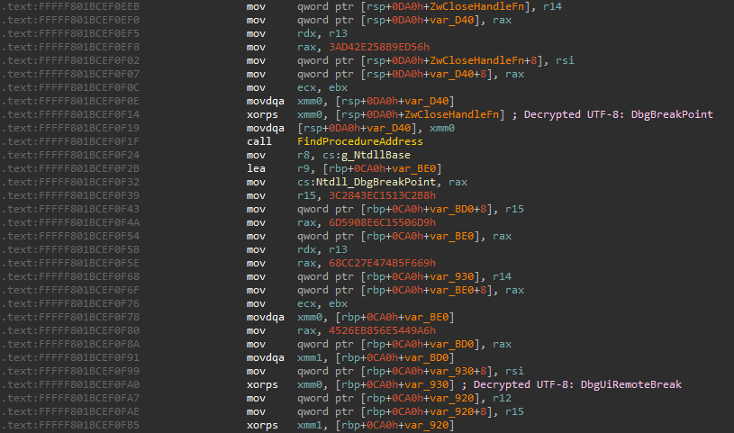
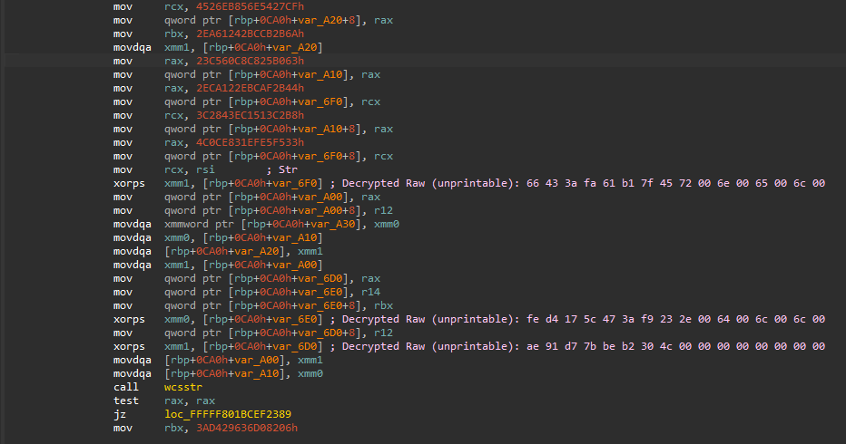

# IDA Xorstr Decryption Plugin
- Attempts to decrypt obfuscated strings in x64 windows binaries using https://github.com/JustasMasiulis/xorstr
- Only tested on a few projects, can be hit or miss
- Tested on IDA 8 and IDA 7.5

### About this fork
This is a personal fork that i modified a bit (with the help of @kkent030315) to handle some edge cases, static decrypting can be quite challenging because of compiler optimizations; it's not always guaranteed that registers are in order so this may lead to incomplete or totally wrong results.

Newly added Decrypted strings result window:

Correctly decrypted results:

Totally wrong decrypted results:

This can be quite handy script but your best bet is to use some x86 emulation engine like Unicorn engine and build some logic to obtain the plain text string.

## Usage
1. Put xorstr_decrypt.py into `<IDA_DIR>/plugins/`
2. Open a binary in IDA and load the plugin directly (`Edit > Plugins > Xorstring Decryptor`), or simply press *Alt + F8*